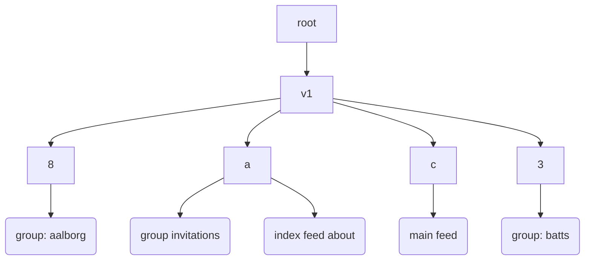
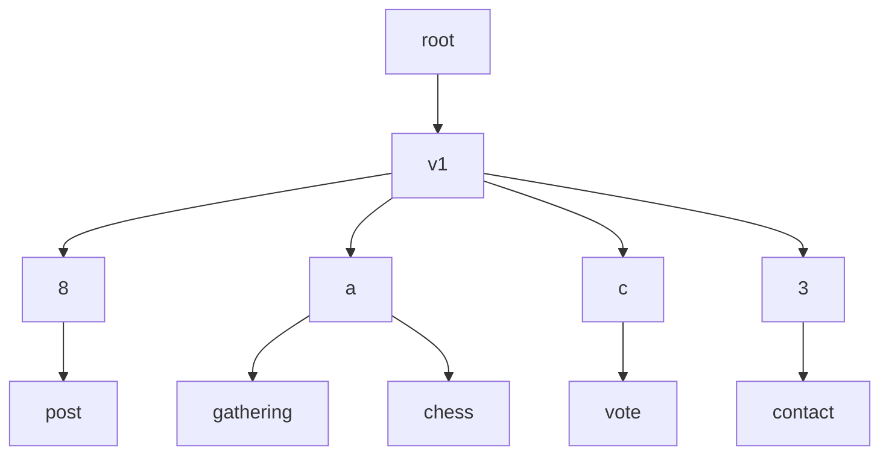

# SSB metafeed migration path

In this document we will describe how to migrate classic SSB, with one
feed per device, to a world with multiple feeds using metafeeds. We
will also define what that means in terms of ID. Note, this document
does not define behavior for applications that do not have to interact
with classic SSB.

## Classic SSB

Classic SSB refers to feeds as defined in the [protocol guide], and
the key used to sign these feeds. In most cases people only have one
feed per device, so let us assume that model in this document. The key
used to sign messages on a feed is the identity of the device, the id
when connecting to other peers using muxrpc. Finally it is also used
for mentions and contacts messages to define the friend relationship.

## Metafeeds

A metafeed is a tree of feeds per device. There is a single feed at
the root of the tree and from this any number of nested subtrees or
subfeeds can exist. These subfeeds can either be new feeds or existing
feeds as defined in the [metafeeds spec].

In order to signal that someone has started using metafeeds, a classic
SSB feed is linked to a metafeed as described in the [existing SSB
identity part of the metafeeds spec]. After migrating, the identity of
the device ought to be the feed id of the root metafeed, but in order
to ease the transition, the classic ID is used until such a time as
the main feed is no longer the classic feed. The identity section in
this specification further refines the ID concept into multiple areas.

### Identity

As described earlier the ID of a device can now be seen as:

- The *signing key*, because we have many feeds, there are now multiple
  signing keys one for each feed.
- The *DM key* used to encrypt and decrypt private messages.
- The *external identity* used to describe yourself to people wanting
  to connect to you, is still the classic ID of the main feed.
- The *network identity* will for now be the classic ID. When the
  [network identity spec] is implemented there can be multiple
  identities all tying back to the same metafeed. Note that this might
  cause connection problems with older clients, so should only be
  implemented at such a time when a majority of the network supports
  metafeeds.
- Mentions should for now also still use the classic ID.
- The friend relationship as defined by contacts messages should
  similar to mentions use the classic SSB id for now. What happens
  after the main feed is changed has not yet been defined.

For multiple devices to act as a single identity the [fusion identity
spec] should be used. This spec defines a new fusion identity that can
be used for: private messages, external identity, mentions and friend
relationship.

### Tree structure

An example of a metafeed tree:



Since a subfeed can be a metafeed itself, this means that the
relationships between subfeeds and metafeeds is a tree. We refer to
the top-most metafeed as the "root" metafeed.

While a metafeed **MAY** contain any arbitrary subfeed, we prescribe a
**RECOMMENDED** structure for the tree.

Under the root metafeed, there **SHOULD** be only one *type* of
subfeed: *versioning subfeeds*. For now, there **SHOULD** be only
subfeed `v1`, but in the future, this spec will be extended to
describe subfeed `v2` once it is time to deprecate `v1`.

The subfeeds at the leafs of the tree contain actual content. Once
there is a new versioning subfeed, the leaf feeds can be transferred
under the new versioning subfeed via `metafeed/add/existing` messages,
without having to recreate the leaf feeds. Thus, the tree structure is
only concerned with the *organization* of feeds in order to assist
partial replication. For example, by grouping together feeds that are
part of the same application under a common metafeed, we can skip
replication of those application feeds if they are not relevant to the
user.

#### v1

This section describes the specification of the organization of
subfeeds under the `v1` versioning subfeed.

To start with, the `v1` versioning subfeed **MUST** be created with
the following `content` on the root metafeed:

```
{
  "type" => "metafeed/add/derived",
  "feedpurpose" => "v1",
  "subfeed" => (BFE-encoded feed ID dedicated for the versioning subfeed),
}
```

The feed format for `v1` **MUST** be [bendy butt], because it is a
metafeed.

The *direct* subfeeds of `v1` are the so-called *shard feeds*. The
actual application-specific subfeeds are under the shard
feeds. Sharding is based on 4 bits of entropy extracted from the
application-specific subfeed, and can be represented by 1 hexadecimal
digit. We will call that digit the "nibble".  The nibbles are: `0`,
`1`, `2`, `3`, `4`, `5`, `6`, `7`, `8`, `9`, `a`, `b`, `c`, `d`, `e`,
`f`. The number of shards is specifically set at 16 to allow for
efficient partial replication in realistic scenarios. See [sharding
math](./sharding-math.md) for mathematical details on the choice of
number of shards.

The purpose of the shard feeds is to allocate the set of
application-specific subfeeds into 16 separate groupings of feeds,
i.e. one for each nibble. This way, if you are only interested in
replicating a subset of the application-specific subfeeds, you can
deterministically calculate the nibble for those application-specific
subfeeds, and then you know which shard feeds to replicate.

When adding a new application-specific subfeed to the tree, we need to
determine the parent shard based on a "name", which is any UTF-8
string that the application can choose freely, but it is
**RECOMMENDED** that this string be unique to the use case. Then, the
shard feed's nibble is calculated as the first hexadecimal digit of
the following SHA256 hash:

```
sha256_hash(concat_bytes(root_metafeed_id, name))
```

where `root_metafeed_id` is the BFE-encoded ID of the root metafeed,
and `name` is a BFE-encoded UTF-8 string.

The nibble is then used to create a new shard feed, unless there is
already one. There **MUST** be at most *one* shard feed for every
unique nibble. The `content` on the root's message for the shard feed
**MUST** have the nibble expressed in hexadecimal and encoded as a
string in the `feedpurpose` field of the `metafeed/add/derived`
message. The feed format for a shard feed **MUST** be [bendy butt],
because they are metafeeds.

Once the shard feed is created, the application-specific subfeeds can
be added as subfeeds of that one, either as `metafeed/add/derived` or
`metafeed/add/existing`.

The following diagram is an example of the organization of subfeeds
under the v1 specification:



Application-specific subfeeds are leafs in the tree, and they **MUST
NOT** be metafeeds that contain other application-specific
subfeeds. This restriction can vastly simplify implementations, and we
don't see a clear need for doing otherwise. If the need arises, we can
allow such cases in the next versions for the tree structure.

### Main feed

There should only be 1 (non-tombstoned) main feed in the tree and it
should use the name 'main feed' to define its position in the
tree. See v1 section above.

FIXME: example of such a message

### Indexes

Applications should define one v1 [index feed], an index of their
classic SSB main feeds about messages. The name 'index feed about'
should be used to define its position in the tree. See v1 section
above.

FIXME: example of such a message

### Private groups

For private groups the group invite feed should always to be included
in the tree as defined in the [group spec]. The tree also includes
individual group feeds for each group the device is a member of.

### Network replication

In classic SSB you replicate feeds in full as defined by your hops
settings. Metafeeds allows one to do partial replication. This could
be both a part of the tree for feeds within your hops distance, such
as not replicating private group feeds you are not a part of, or it
could be only replicating the index feed and common private groups for
feeds outside of your hops range. Clients are expected to replicate as
much of the tree that they can within their hops range to increase the
likelihood that content will be available when replicating with peers.

Lets consider the scenarios:

 - full replication: you start out by replicating the main feed as you
   know this id from the friend relationship. Once you discover a
   message with type 'metafeed/announce' on the main feed, you start
   replicating this metafeed and in turn all subfeeds including index
   feeds using normal EBT replication.
 - partial replication of a device with private groups in common: the
   root metafeed id should be given from a group/add-member
   message. From this the tree structure of the metafeed can be
   replicated including index feeds and the feeds of private groups in
   common, but not the main feed. To replicate the main feed you
   follow them.
 - partial replication of a device outside your hops range: a client
   can choose to replicate feeds at max hops + 1 using partial
   replication. To discover the metafeed id we use the RPC `getSubset`
   from [subset replication] on any connected peer, asking for a
   message of type 'metafeed/announce' on the main feed. If connected
   peers do not support this RPC, then we can fallback to
   createHistoryStream to fetch the full feed in memory (i.e. without
   persisting it to the log). From this we persist the
   'metafeed/announce' message and from there we can replicate the
   metafeeds tree and the about index feed.

When replicating index feeds using EBT it is important to make sure
that you don't get duplicate messages in your database, this is
similar to adding messages out-of-order (ooo). This can either be done
by checking the local database before inserting the indexed message or
by keeping track of what messages you already have on the main feed.

[protocol guide]: https://ssbc.github.io/scuttlebutt-protocol-guide/#feeds
[metafeeds spec]: https://github.com/ssbc/ssb-meta-feeds-spec
[existing SSB identity part of the metafeeds spec]: https://github.com/ssbc/ssb-meta-feeds-spec/#existing-ssb-identity
[network identity spec]: https://github.com/ssbc/ssb-network-identity-spec
[fusion identity spec]: https://github.com/ssbc/fusion-identity-spec
[v1 part]: https://github.com/ssbc/ssb-meta-feeds-spec/#v1
[group spec]: https://github.com/ssbc/ssb-meta-feed-group-spec
[index feed]: https://github.com/ssbc/ssb-secure-partial-replication-spec#indexes
[subset replication]: https://github.com/ssbc/ssb-subset-replication-spec
